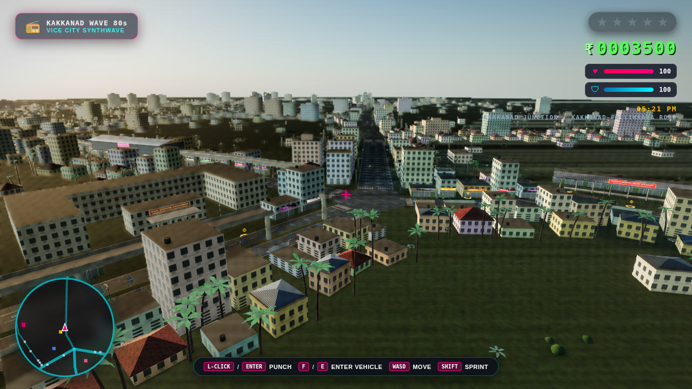
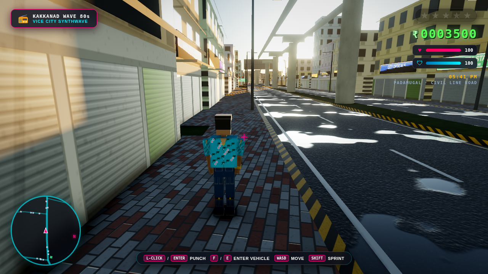
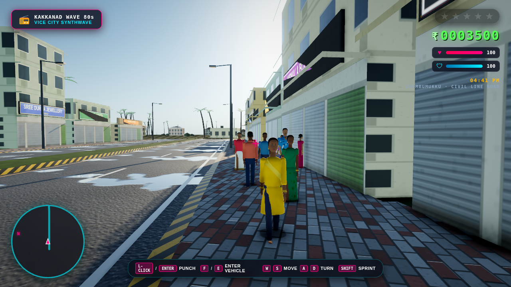
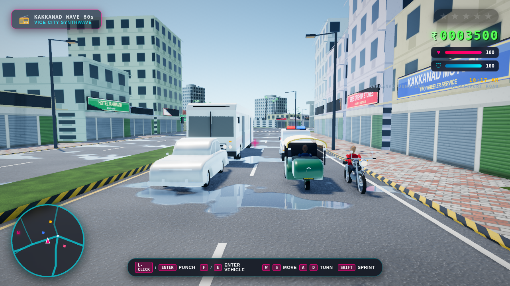
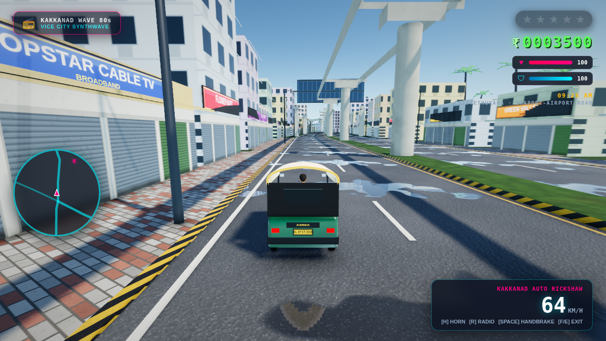
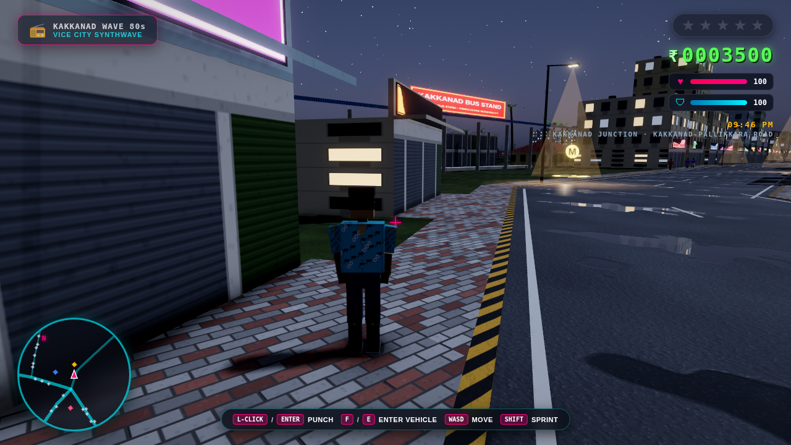
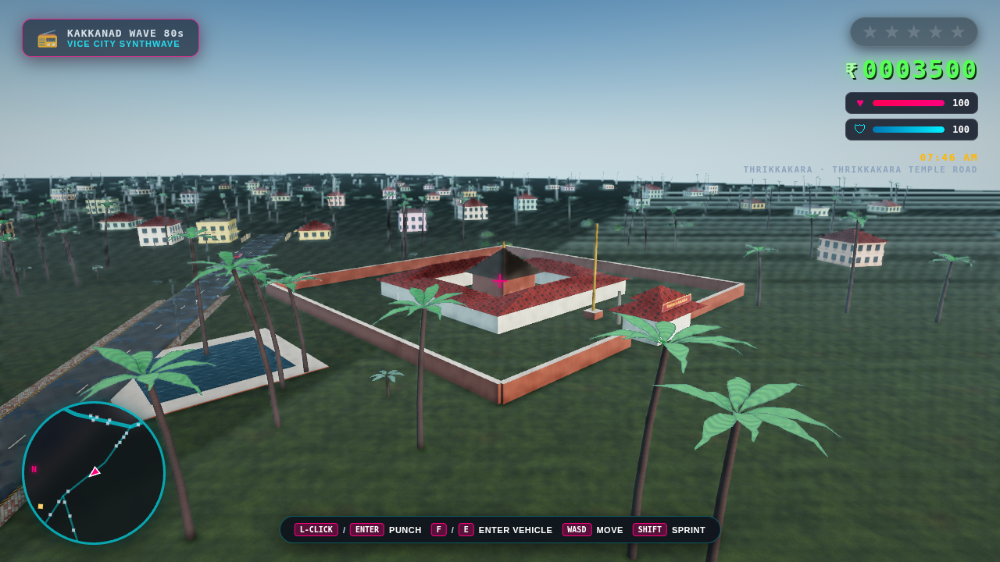
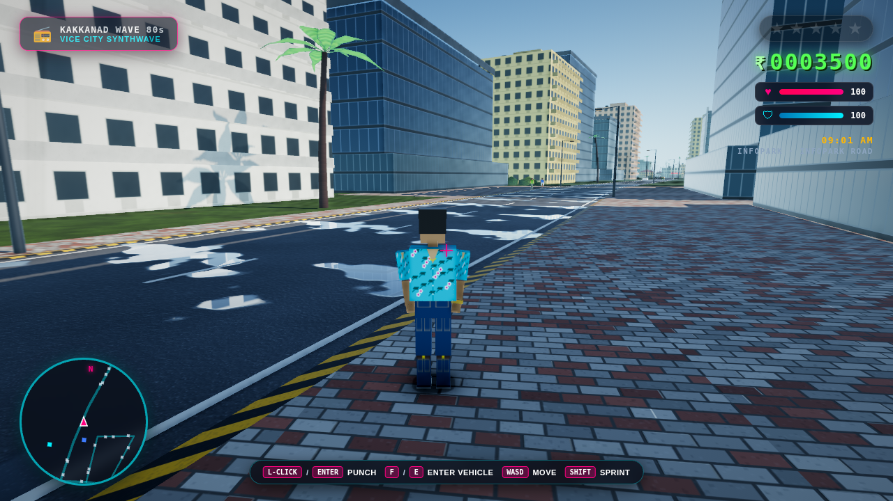

# 🌴 GTA: Vice City Kakkanad (ഗ്രാൻഡ് തെഫ്റ്റ് ഓട്ടോ: കാക്കനാട്)

An open-world 3D browser game set in **Kakkanad, Kochi, Kerala**. It has a modern physically based renderer and GTA V-style camera, on-foot and driving motion.

The roads and places are the real ones, with their real names and positions: Seaport-Airport Road, Civil Line Road, Infopark Expressway, Civil Station, Infopark, SmartCity, Thrikkakara Temple, the Water Metro and the Metro Pink Line. The buildings in between are imagined, Kerala style.

Built with Three.js (r128, vendored) and the native Web Audio API: **zero npm packages, zero build steps, runs from `index.html` on any static server.**

---

## 📸 Screenshots

| | |
| :---: | :---: |
|  |  |
| *Kakkanad Junction at golden hour: Civil Station (left), Seaport-Airport Road heading north, the bus stand (right), the Metro Pink Line viaduct* | *Padamugal, Civil Line Road: shop rows with flex boards, metro piers on the widened median* |
|  |  |
| *Chembumukku, Civil Line Road: a churidar with a dupatta, sarees, a mundu, shirts and trousers* | *Waiting at a signal on Seaport-Airport Road: Ambassador, auto rickshaw, Bullet, Kerala Police SUV and a Minnal bus* |
|  |  |
| *Driving the auto up Seaport-Airport Road at Chittethukara, under the Metro Pink Line* | *Night by Kakkanad bus stand, with a yellow mission marker* |
|  |  |
| *Thrikkakara Temple: laterite wall, gopuram, copper-roofed shrine, gold flagstaff and temple pond* | *Morning on Infopark Road* |

---

## 🗺️ The Map: Real Kakkanad

- **Real names on real coordinates.** 23 roads, 20 landmarks and 25 localities, placed from about 40 real latitude/longitude anchors (`src/data/kakkanad-geo.js`). The HUD shows where you are, e.g. `PADAMUGAL · CIVIL LINE ROAD`.
  - **Roads:** Seaport-Airport Road, Civil Line Road, Kakkanad-Pallikkara Road, Infopark Expressway, Infopark Road, NGO Quarters Road, Thrikkakara Temple Road, Thuthiyoor Road and more.
  - **Places:** Civil Station (Collectorate), Kakkanad Bus Stand, Infopark (Athulya, Thejomaya, Vismaya, Jyothirmaya), SmartCity Kochi, Cochin SEZ, KINFRA, Kakkanad Water Metro, Thrikkakara Temple, Bharata Mata College, KMM College, Model Engineering College, Sunrise Hospital, Kusumagiri, Rajagiri Valley, Padamugal and Civil Station mosques, Edachira thattukadas.
  - **Localities:** Padamugal, Kunnumpuram, Vazhakkala, Chembumukku, Chittethukara, Thengode, Athani, Edachira and more.
- **Kochi Metro Pink Line** (under construction, 2026) runs on its real route: along Civil Line Road, down Seaport-Airport Road and out along Infopark Expressway. Its piers stand on the median, some deck spans are still missing, and there are station boxes at Vazhakkala, Padamughal, Kakkanad Junction, Cochin SEZ, Chittethukara, KINFRA and Infopark.
- **Rivers:** the Kadambrayar, crossed by a bridge on Kakkanad-Pallikkara Road, and the Chithrapuzha at the Water Metro terminal.
- **Imagined:**
  - Every building: shop-houses with rolling shutters and backlit flex boards (shop names are invented), Kerala houses with Mangalore-tile roofs and compound walls, flats, Infopark-style glass towers, industrial sheds;
  - the coconut groves;
  - the minor bends between anchors.
- **True orientation:** north is up on the radar, the compass points north, and the sun rises in the east at Kochi's latitude.
- **Scale:** distances are compressed to 60% so it plays like a GTA map. Bearings and relative positions stay true, and road widths and building heights are real size.

---

## ✨ Features

### Graphics
- **Physically based materials**: dielectric asphalt, clear-coat car paint, glass curtain walls, rubber, chrome. Albedo, normal and roughness textures are generated procedurally at load (no image assets).
- **Correct colour pipeline**: linear lighting, ACES filmic tone mapping, sRGB output, and a neutral colour grade that shifts with the time of day (warmer at golden hour, cooler at night).
- **Physically based sky and day/night cycle**: a Preetham analytic sky driven by the game clock, with the sun on its real path over Kochi (10°N). Sun colour comes from atmospheric transmittance; there is also a full moon, stars and a twilight glow. Ambient light is image-based, taken from the live sky.
- **Shadows**: soft shadows that follow the player, snapped to the shadow-map grid and fading out at their edges, plus soft contact shadows under every vehicle and person.
- **Atmosphere**: exponential height fog plus distance fog with a sun-coloured glow, and morning haze.
- **Post-processing** (Medium/High):
  - screen-space ambient occlusion;
  - restrained bloom;
  - subtle camera motion blur that keeps the player sharp;
  - FXAA or 4× MSAA.
- **Monsoon roads**: puddles that mirror the sky and wet-road reflection streaks under street lamps, plus screen-space reflections of the city on High.
- **Night city**: lit office windows, neon, street lamps with light pools, head, tail and brake lights, and the player's headlights.
- **Procedural city**: about 4,800 generated buildings, 7,000 coconut palms, 8,000 bushes, 650 street lamps, signals at the big junctions, and green place-name boards at every junction.
- **Roads**: junction patches that never overlap, raised kerbs painted black-and-yellow, paver sidewalks with corner fills, medians, lane paint, zebra crossings and stop lines.
- **Performance**:
  - all static geometry merged per material per map cell, with three detail levels (buildings and roads far, paint and palms mid, small props near);
  - per-tier draw distance and night-only light cones;
  - vehicles drop wheel and driver detail beyond 65 m;
  - dynamic resolution.
  - The dense city renders in about 270 main and 90 shadow draw calls at street level, people and traffic included.

### Vehicles and people
- **Vehicles** are modelled from side profiles with real proportions: wheel-arch cut-outs, rounded bevelled bodies, a narrower glasshouse with tinted glass, chrome and black trim, round or square lamps, Kerala number plates, lathe-turned tyres and rims (alloy, steel, hubcaps, wire spokes).
  - **Auto rickshaw**: green tub, yellow canvas hood, single front wheel with a mudguard, commercial (yellow) plates.
  - **Minnal private bus**: painted livery with its name and route, glowing route board, doors on the kerb side, roof rails.
  - **Kerala Police SUV** with POLICE door panels, a light bar and a bull bar; the domed **Ambassador** with its chrome grille; the **Bullet 350** with a teardrop tank and a long exhaust; a wedge sports car.
- **People** have sculpted heads (skull, brow, cheekbones, jaw, chin), a modelled nose and ears, and painted faces in real proportions: eyes with irises, brows, lips, Kerala moustaches and beards, bindis, kajal and sandal paste.
  - Men wear shirts (collar, buttons, pocket) or T-shirts with a lungi, a mundu with a gold kasavu border, or trousers.
  - Women wear sarees (some in the cream-and-gold Kerala set-saree) with the pallu over the shoulder, or a churidar with a dupatta. They have braids or a bun with jasmine, jhumkas and bangles.
  - The player wears an open-necked Hawaiian shirt with a gold chain.

### Motion
- **Camera**: GTA V-style third person.
  - Spring-damped follow of the direction of travel, so drifts show the car's flank.
  - FOV widens with speed, and the view looks ahead and leans into turns.
  - Collision with buildings and parked vehicles.
  - Mouse orbit with auto-recentre and subtle shake.
  - Hood/first-person and cinematic modes.
- **On foot**:
  - Classic GTA controls: `A`/`D` turn the view and the player turns with it (stepping round on the spot when standing still), `W`/`S` run where the camera looks. The camera settles in behind you when you run; the mouse is optional.
  - Acceleration, turn inertia and sprint.
  - Procedural walk/run animation on a jointed rig: knees, elbows, lean, bob, banking into turns.
  - Punch wind-up and strike, jump and landing.
- **Vehicles**:
  - Tyre-model handling with weight transfer and handbrake drifts.
  - Speed-sensitive steering; cars understeer at the limit instead of spinning.
  - Off-road grip loss.
  - Spring-damped body roll and pitch (bikes lean into turns), steering front wheels and spinning spoked wheels.

### Gameplay
- Melee punch combat with knockouts, cash drops and panicking pedestrians.
- Carjacking and driving the **Kakkanad auto rickshaw**, **Minnal private bus**, **Kerala Police jeep**, **Ambassador**, **Bullet 350** and a sports car.
- **Traffic keeps left**, as in India. It follows lanes, turns through junctions on smooth curves, brakes and honks for whatever is ahead, and changes lane when blocked.
- Pedestrians walk the sidewalks. Traffic and pedestrians are recycled around you, so the whole city feels busy.
- Buildings, walls, palms, metro piers and rivers are solid, on foot and in a vehicle; hard crashes shake the camera.
- Kerala Police chase along the roads, taking the junction that leads to you, and ram you when close. You get 1–5 wanted stars.
- **WASTED** respawns you at Sunrise Hospital (or Kusumagiri); **BUSTED** at the nearest police station (Thrikkakara or Infopark).
- **Four timed missions between real places.** Walk or drive into a yellow **M** marker to start one:
  - Infopark punch-in;
  - the last Water Metro boat;
  - the Collectorate heist with a 3-star chase to SmartCity;
  - Onam flowers for Thrikkakara Temple.
- Synthesised radio stations, horns, sirens and engine sounds.
- HUD: radar that rotates with the camera, vitals, cash, wanted stars, clock, location, speedometer.

---

## 🎮 Controls

| Action | Keybinding |
| :--- | :--- |
| **Run forwards / back** | `W` / `S` or `↑` / `↓` (accelerate / brake and reverse when driving) |
| **Turn** | `A` / `D` or `←` / `→`: the player and the view turn together, as in the classic GTA games, so you can play with the keyboard alone (steer when driving) |
| **Look around (optional)** | Mouse: click the game to capture the mouse (`Esc` releases), or hold the right button and drag |
| **Punch** | `Left-Click` or `Enter` / `J` |
| **Enter / Carjack / Exit Vehicle** | `F` or `E` |
| **Sprint** | `Shift` (hold while moving on foot) |
| **Jump (On Foot) / Handbrake (Vehicle)** | `Space` |
| **Vehicle Horn** | `H` |
| **Cycle Radio Stations** | `R` |
| **Switch Camera Mode** | `C` (Chase / Hood / Cinematic) |
| **Graphics Quality** | `G` (Low → Medium → High) |
| **Performance Overlay** | `P` (FPS, frame time, draw calls, resolution) |
| **Start a Mission** | Walk or drive into a yellow **M** marker |

---

## ⚙️ Graphics Quality

Pick **Auto / Low / Medium / High** on the start screen or press `G` in game. The choice is remembered. You can also force a tier with a URL parameter, e.g. `?quality=high`.

| | Low | Medium | High |
| :--- | :---: | :---: | :---: |
| Render path | direct to canvas | HDR pipeline | HDR pipeline |
| Anti-aliasing | canvas MSAA | FXAA | 4× MSAA (WebGL2) |
| Shadow map | 1024², 45 m | 2048², 70 m | 4096², 90 m |
| Ambient occlusion | contact shadows | SSAO (8 taps) | SSAO (12 taps) |
| Bloom / motion blur | off | on | on |
| Wet-road SSR / clear-coat paint | off | off | on |
| Max pixel ratio | 1.0 | 1.0 | 1.5 |
| City draw distance | 620 m | 1,000 m | 1,300 m |

**Auto** picks a tier from the GPU, then a dynamic-resolution governor lowers the render scale if frames take longer than about 19 ms. If that isn't enough, it drops a tier. Target: about 60 fps on a laptop (Medium on Intel Iris Xe-class integrated GPUs).

---

## 🚀 Running Locally

No npm or build step required. Any static HTTP server works:

```bash
# Using Python 3
python3 -m http.server 8085

# Or using npx serve
npx serve -l 8085
```

Open your browser to **`http://localhost:8085`** (add `?quality=low|medium|high` to force a tier).

### Development checks (optional)

These are dev-only Node scripts; the game never loads them:

```bash
node tools/unit-checks.js    # vehicle handling, camera spring, sun path, map data + road graph
node tools/smoke-test.js --tiers=low,medium,high --switch --shots=/tmp/shots
                             # headless Chromium (needs Playwright + Chromium): feature
                             # scenario, zero console errors, draw calls, screenshots
```

---

## 🏛️ Project Architecture

```
vicecity-kakkanad/
├── index.html              # Entry: HUD, start screen with graphics picker, script order
├── styles.css              # HUD / menu styling
├── libs/
│   ├── three.min.js        # Three.js r128 (MIT)
│   └── three-examples/     # Unmodified r128 example code (MIT): BufferGeometryUtils, FXAAShader
├── assets/screenshots/
├── tools/                  # Dev-only: smoke-test.js (headless Chromium), unit-checks.js (Node)
└── src/
    ├── gfx/
    │   ├── materials.js    # Colour management, global shader patches (height fog, shadow fade), glow registry, texture helpers
    │   ├── quality.js      # Low/Medium/High/Auto tiers, dynamic resolution, perf overlay
    │   ├── batch.js        # Static batching per material and cell, 3 detail levels, raw vertex writer
    │   ├── sky.js          # Time of day, Preetham sky, sun/moon light, IBL, fog, exposure, grade
    │   └── effects.js      # Wet-road lamp streaks, contact shadows
    ├── data/
    │   └── kakkanad-geo.js # Real Kakkanad roads, landmarks, localities, rivers, metro (lat/lon)
    ├── config.js           # Frozen config derived from the geo data, vehicle archetypes, missions
    ├── roadgraph.js        # Junction nodes/edges, trims, lanes (keep left), nearest-road grid
    ├── postprocessing.js   # HDR pipeline: SSAO, bloom, motion blur, SSR, ACES, FXAA
    ├── surfaces.js         # Procedural PBR surfaces (asphalt, pavers, curbs, ground, water, facades)
    ├── foliage.js          # Coconut palms and banana plants with wind sway
    ├── models.js           # Vehicles (profile bodies, sprung body, palette material, lights), people (parametric heads, painted faces, rigs)
    ├── citygen.js          # Kerala building kit: facades, tiles, signs, boards, building types
    ├── map.js              # Roads, junctions, rivers, metro, landmarks, generated city, palms, collisions
    ├── vehicle-physics.js  # Tyre-model vehicle dynamics and suspension visuals
    ├── locomotion.js       # On-foot controller and procedural gait
    ├── camera.js           # Third-person camera rig
    ├── player.js           # On-foot combat, carjacking, driving
    ├── traffic.js          # Lane-following traffic and sidewalk pedestrians
    ├── police.js           # Wanted levels and pursuit along the road graph
    ├── missions.js         # Mission engine, start markers and beacons
    ├── audio.js            # Web Audio radio and vehicle sounds
    ├── hud.js              # Radar, vitals, speedometer, clock
    └── main.js             # Engine: renderer, quality, render path, game loop
```

---

## 📜 License & Credits

MIT License. Everything is original or procedural: all textures and models are generated in code, and nothing is taken from Rockstar Games.

About the map:
- **Real names and positions** come from facts: place and road names, and coordinates compiled from public place listings and from the Wikipedia/Wikidata coordinates of Civil Station, InfoPark and Thrikkakara Temple.
- **Road order** follows the Kochi Metro Phase 2 station sequence and public descriptions of the roads.
- **Nothing is copied from map providers:** no data or tiles from Google Maps or OpenStreetMap, and no photographs.
- **Invented:** every building, shop name and river course, and the road bends between the anchors. Anchors are marked `// real`, invented points `// ~`.

Third-party code, all MIT licensed (© three.js authors, see `libs/three-examples/LICENSE`):
- **three.js r128**, vendored unmodified.
- `libs/three-examples/BufferGeometryUtils.js` and `FXAAShader.js`, copied unmodified from three.js r128 examples. FXAA by Timothy Lottes (NVIDIA), via three.js.
- The sky's scattering maths in `src/gfx/sky.js`, derived from the three.js r128 `Sky.js` example: the Preetham daylight model, first implemented by Simon Wallner, improved by Martin Upitis, three.js integration by zz85.

Inspired by Rockstar Games' *Grand Theft Auto* series.
