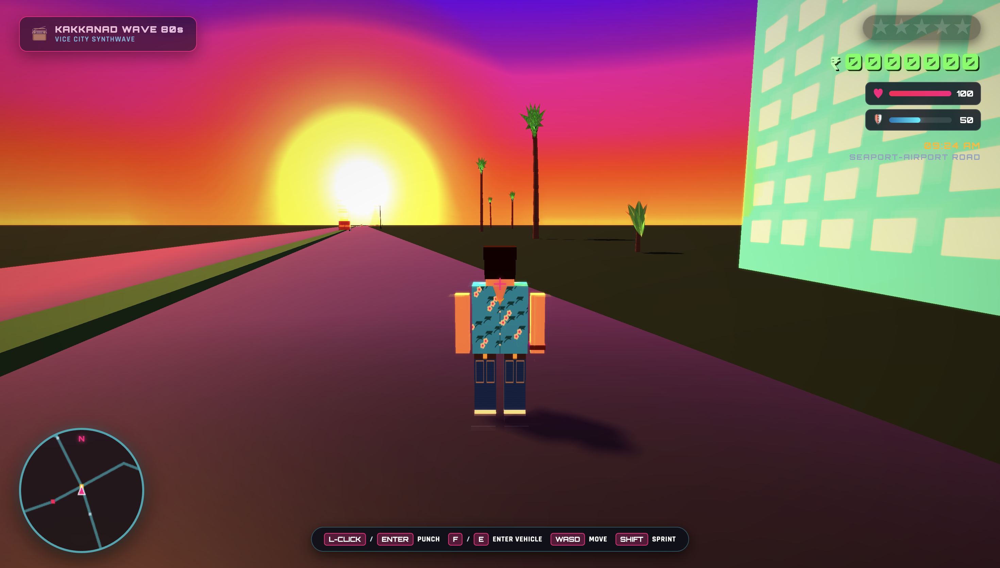
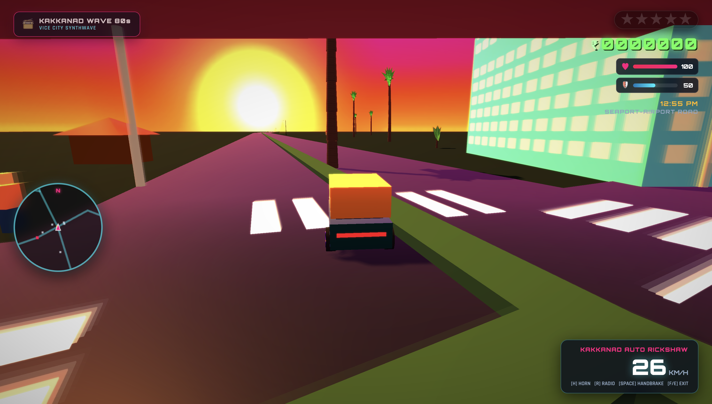
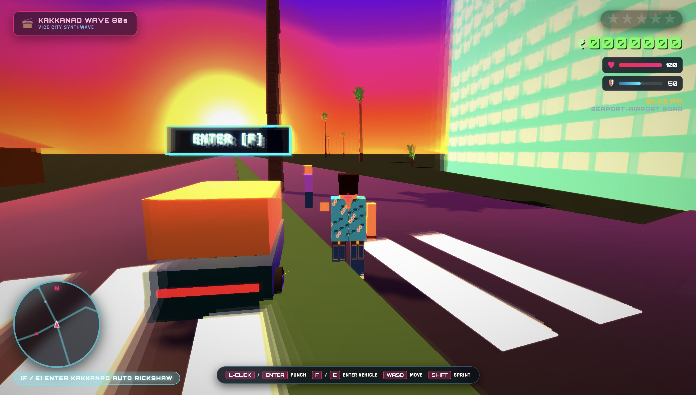
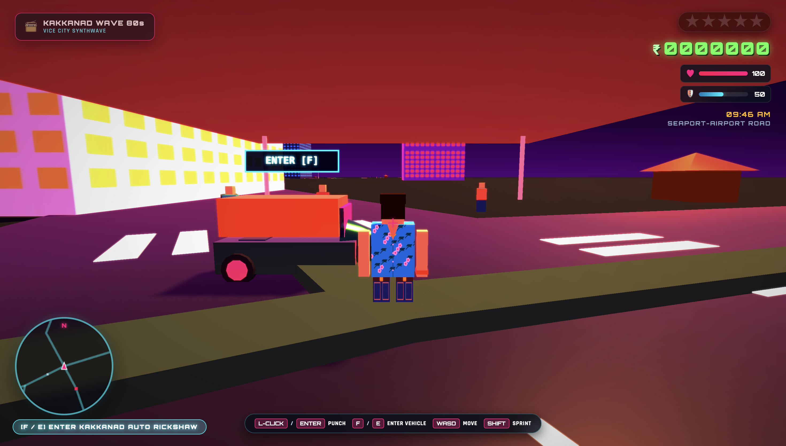

# 🌴 GTA: Vice City Kakkanad (ഗ്രാൻഡ് തെഫ്റ്റ് ഓട്ടോ: കാക്കനാട്)

A full-fledged, high-fidelity 3D open-world web game recreating the iconic 1980s aesthetic of **Grand Theft Auto: Vice City (2002)** set across the real-world road and landmark network of **Kakkanad, Kochi, Kerala**.

Built with pure Three.js WebGL and the native Web Audio API — **zero npm packages, zero external build steps, runs instantly in any modern browser.**

---

## 📸 Screenshots & Showcase

### 1. 1980s Vice City Radiant Sunset & Open Highway
*Custom 360-degree equirectangular sky with radiant horizon sun, RenderWare bloom, alpha-cutout coconut palms, Kerala hazard-striped curbs, and Tommy Vercetti in his signature tropical Hawaiian floral shirt and denim jeans.*



---

### 2. Driving the Kakkanad Auto Rickshaw
*Hijack and drive the authentic Kerala 3-wheeler Auto Rickshaw down Seaport-Airport Road with real-time cockpit speedometer, drift handbrake physics, and synthesized engine sounds.*



---

### 3. RenderWare Trails Motion Blur & Melee Combat
*Authentic RenderWare accumulation framebuffer motion blur shader in action as Tommy punches pedestrians on foot.*



---

### 4. 360-Degree Panoramic View & Infopark IT Towers
*Explore Infopark Phase 1, SmartCity, Collectorate administrative roundabout, and roadside Thattukadas.*



---

## ✨ Features

- **100% 1:1 Vice City Visual Parity**:
  - **RenderWare Trails**: Dual ping-pong accumulation framebuffer motion blur on bright headlights and neon signs.
  - **Unreal Bloom & Glare**: 9-tap cross-sampling bloom filter delivering dreamy atmospheric glow.
  - **1980s Miami Sunset Split-Tone Grading**: Dual split-toning with golden amber sunlight highlights and twilight purple/fuchsia shadow contrast.
  - **Alpha-Cutout Tropical Foliage**: Procedural high-resolution coconut palm fronds with individual leaflets and coconut clusters.
  - **Procedural Surface Textures**: Kerala yellow-and-black diagonal hazard striped curbs, asphalt road diffuse/bump maps, and paver sidewalks.
- **Authentic Kerala 3D Vehicles**:
  - **Kakkanad Auto Rickshaw** (3-wheeler green/yellow livery, agile drift mechanics, dual-tone "pom-pom" horn).
  - **Kerala Private Bus ("Minnal" / "Komban")** (Red/yellow express livery, dual headlights, loud musical air-horn).
  - **Kerala Police Mahindra Jeep** (White/blue livery, flashing red/blue roof beacon strobes, pursuit sirens).
  - **Classic Ambassador** (Vintage white saloon official car with chrome grille).
  - **Vice City Infernus** (1980s neon sports coupe).
- **On-Foot & Vehicle Gameplay**:
  - Full melee punch combat with hit detection, damage popups, and ragdoll knockouts with cash drops.
  - Seamless carjacking and entry (`[F]` / `[E]`).
  - Vehicle physics with acceleration, braking, reverse, steering, and handbrake drifting (`[SPACE]`).
- **Interactive Missions & Police Heat System**:
  - Multi-tier wanted levels (1 to 5 stars) with Kerala Police pursuit AI, roadblocks, and sirens.
  - Timed delivery and objective missions with 3D checkpoint beacons.
- **Synthesized 80s Synthwave Radio**:
  - Dynamic Web Audio API synthesizer featuring multiple stations:
    - 📻 **Kakkanad Wave 80s** (Vice City synthwave basslines and arpeggios)
    - 📻 **Radio Kochi Beats** (Percussive Kerala electronic fusion)
    - 📻 **Infopark Lo-Fi Lounge** (Chilled developer beats)

---

## 🎮 Controls

| Action | Keybinding |
| :--- | :--- |
| **Move / Steer** | `W`, `A`, `S`, `D` or `Arrow Keys` |
| **Punch / Attack** | `Left-Click` or `SPACE` / `ENTER` |
| **Enter / Carjack / Exit Vehicle** | `F` or `E` |
| **Sprint** | `SHIFT` (Hold while moving on foot) |
| **Jump (On Foot) / Handbrake (Vehicle)** | `SPACE` |
| **Vehicle Horn** | `H` (Auto Rickshaw "pom-pom" / Bus air horn) |
| **Cycle Radio Stations** | `R` |
| **Switch Camera Mode** | `C` (Chase Cam / Hood POV / Bird's Eye) |

---

## 🚀 Running Locally

No npm or external installations required. Any static HTTP server will work:

```bash
# Using Python 3
python3 -m http.server 8085

# Or using npx serve
npx serve -l 8085
```

Open your browser to:
👉 **`http://localhost:8085`**

---

## 🏛️ Project Architecture

```
vice-city-kakkanad/
├── index.html            # Main HTML entry with retro 80s HUD and modal UI
├── styles.css            # Vice City neon typography and CRT/bloom HUD styling
├── libs/
│   └── three.min.js      # Local Three.js r128 engine
├── assets/
│   └── screenshots/      # High-resolution gameplay captures
└── src/
    ├── config.js         # Frozen map coordinates, road graphs, vehicle archetypes
    ├── asset-loader.js   # 3D asset manager with procedural geometry fallbacks
    ├── postprocessing.js # Two-pass RenderWare Trails & Unreal Bloom shader composer
    ├── surfaces.js       # Procedural asphalt, Kerala hazard curbs, and sidewalks
    ├── foliage.js        # Alpha-cutout coconut palms, fronds, and banana plants
    ├── models.js         # Tommy Vercetti character model and 3D Kerala vehicles
    ├── map.js            # OpenStreetMap-derived Kakkanad roads, bridges, and landmarks
    ├── player.js         # Player physics, on-foot combat, carjacking, and driving dynamics
    ├── traffic.js        # Ambient AI civilian traffic and pedestrian pathfinding
    ├── police.js         # Crime heat, pursuit AI, and siren strobes
    ├── missions.js       # Mission engine, objective beacons, and reward economy
    ├── audio.js          # Web Audio synthwave radio and vehicle sound engine
    ├── hud.js            # Mini-map radar, speedometer, vitals, and wanted stars
    └── main.js           # Master game loop, camera modes, and engine coordinator
```

---

## 📜 License

MIT License. Inspired by Rockstar Games' *Grand Theft Auto: Vice City* (2002).
