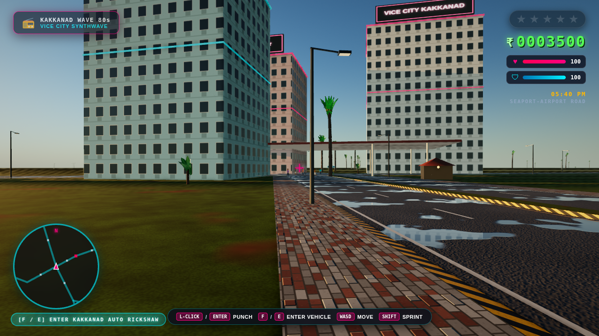
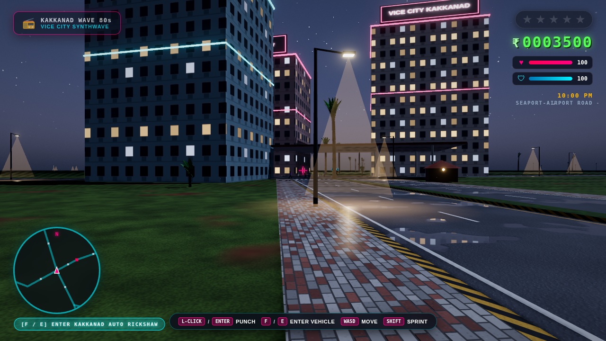
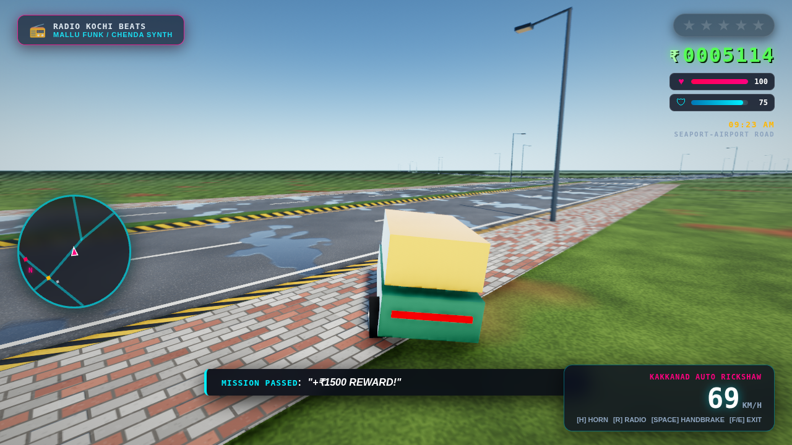
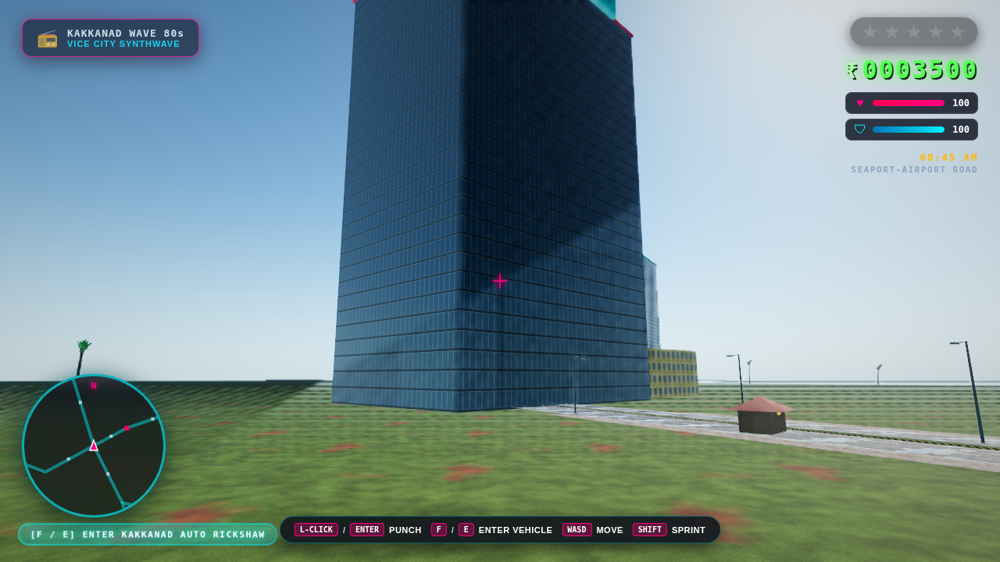

# 🌴 GTA: Vice City Kakkanad (ഗ്രാൻഡ് തെഫ്റ്റ് ഓട്ടോ: കാക്കനാട്)

An open-world 3D browser game set on the real road and landmark network of **Kakkanad, Kochi, Kerala**, with a modern physically based renderer and GTA V-style camera, on-foot and driving motion.

Built with Three.js (r128, vendored) and the native Web Audio API: **zero npm packages, zero build steps, runs from `index.html` on any static server.**

---

## 📸 Screenshots

| | |
| :---: | :---: |
|  |  |
| *Golden hour: sun-coloured haze, soft follow shadows, PBR facades* | *Night: lit windows, neon bloom, lamp and window reflections on the wet road* |
|  |  |
| *Driving: camera lags into the turn, body roll, motion blur* | *Morning: glass curtain walls reflecting the live sky* |

---

## ✨ Features

### Graphics
- **Physically based materials**: dielectric asphalt, clear-coat car paint, glass curtain walls, rubber, chrome. Albedo, normal and roughness textures are generated procedurally at load (no image assets).
- **Correct colour pipeline**: linear lighting, ACES filmic tone mapping, sRGB output, and a neutral colour grade that shifts with the time of day (warmer at golden hour, cooler at night).
- **Physically based sky and day/night cycle**: a Preetham analytic sky driven by the game clock, with the sun on its real path over Kochi (10°N). Sun colour comes from atmospheric transmittance; there is also a full moon, stars and a twilight glow. Ambient light is image-based, taken from the live sky.
- **Shadows**: soft shadows that follow the player, snapped to the shadow-map grid and fading out at their edges, plus soft contact shadows under every vehicle and person.
- **Atmosphere**: exponential height fog plus distance fog with a sun-coloured glow, and morning haze.
- **Post-processing** (Medium/High):
  - screen-space ambient occlusion;
  - restrained bloom;
  - subtle camera motion blur that keeps the player sharp;
  - FXAA or 4× MSAA.
- **Monsoon roads**: puddles that mirror the sky and wet-road reflection streaks under street lamps, plus screen-space reflections of the city on High.
- **Night city**: lit office windows, neon, street lamps with light pools, head, tail and brake lights, and the player's headlights.
- **Performance**: static geometry merged by material and map cell (about 1,300 draw calls down to about 200), draw distances for traffic and pedestrians, and dynamic resolution.

### Motion
- **Camera**: GTA V-style third person.
  - Spring-damped follow of the direction of travel, so drifts show the car's flank.
  - FOV widens with speed, and the view looks ahead and leans into turns.
  - Collision with buildings and parked vehicles.
  - Mouse orbit with auto-recentre and subtle shake.
  - Hood/first-person and cinematic modes.
- **On foot**:
  - Camera-relative movement with acceleration, turn inertia and sprint.
  - Procedural walk/run animation on a jointed rig: knees, elbows, lean, bob, banking into turns.
  - Punch wind-up and strike, jump and landing.
- **Vehicles**:
  - Tyre-model handling with weight transfer and handbrake drifts.
  - Speed-sensitive steering; cars understeer at the limit instead of spinning.
  - Off-road grip loss.
  - Spring-damped body roll and pitch (bikes lean into turns), steering front wheels and spinning spoked wheels.

### Gameplay
- Melee punch combat with knockouts, cash drops and panicking pedestrians.
- Carjacking and driving the **Kakkanad auto rickshaw**, **Minnal private bus**, **Kerala Police jeep**, **Ambassador**, **Bullet 350** and a sports car.
- Kerala Police pursuit AI with 1–5 wanted stars; WASTED / BUSTED respawns.
- Three timed story missions with checkpoint beacons.
- Synthesised radio stations, horns, sirens and engine sounds.
- HUD: radar that rotates with the camera, vitals, cash, wanted stars, clock, location, speedometer.

---

## 🎮 Controls

| Action | Keybinding |
| :--- | :--- |
| **Move / Steer** | `W`, `A`, `S`, `D` or `Arrow Keys` (on foot, relative to the camera) |
| **Look around** | Mouse: click the game to capture the mouse (`Esc` releases), or hold the right button and drag |
| **Punch** | `Left-Click` or `Enter` / `J` |
| **Enter / Carjack / Exit Vehicle** | `F` or `E` |
| **Sprint** | `Shift` (hold while moving on foot) |
| **Jump (On Foot) / Handbrake (Vehicle)** | `Space` |
| **Vehicle Horn** | `H` |
| **Cycle Radio Stations** | `R` |
| **Switch Camera Mode** | `C` (Chase / Hood / Cinematic) |
| **Graphics Quality** | `G` (Low → Medium → High) |
| **Performance Overlay** | `P` (FPS, frame time, draw calls, resolution) |

---

## ⚙️ Graphics Quality

Pick **Auto / Low / Medium / High** on the start screen or press `G` in game. The choice is remembered. You can also force a tier with a URL parameter, e.g. `?quality=high`.

| | Low | Medium | High |
| :--- | :---: | :---: | :---: |
| Render path | direct to canvas | HDR pipeline | HDR pipeline |
| Anti-aliasing | canvas MSAA | FXAA | 4× MSAA (WebGL2) |
| Shadow map | 1024², 45 m | 2048², 70 m | 4096², 90 m |
| Ambient occlusion | contact shadows | SSAO (8 taps) | SSAO (12 taps) |
| Bloom / motion blur | off | on | on |
| Wet-road SSR / clear-coat paint | off | off | on |
| Max pixel ratio | 1.0 | 1.0 | 1.5 |

**Auto** picks a tier from the GPU, then a dynamic-resolution governor lowers the render scale if frames take longer than about 19 ms. If that isn't enough, it drops a tier. Target: about 60 fps on a laptop (Medium on Intel Iris Xe-class integrated GPUs).

---

## 🚀 Running Locally

No npm or build step required. Any static HTTP server works:

```bash
# Using Python 3
python3 -m http.server 8085

# Or using npx serve
npx serve -l 8085
```

Open your browser to **`http://localhost:8085`** (add `?quality=low|medium|high` to force a tier).

### Development checks (optional)

These are dev-only Node scripts; the game never loads them:

```bash
node tools/unit-checks.js    # vehicle handling per archetype, camera spring, sun path
node tools/smoke-test.js --tiers=low,medium,high --switch --shots=/tmp/shots
                             # headless Chromium (needs Playwright + Chromium): feature
                             # scenario, zero console errors, draw calls, screenshots
```

---

## 🏛️ Project Architecture

```
vicecity-kakkanad/
├── index.html              # Entry: HUD, start screen with graphics picker, script order
├── styles.css              # HUD / menu styling
├── libs/
│   ├── three.min.js        # Three.js r128 (MIT)
│   └── three-examples/     # Unmodified r128 example code (MIT): BufferGeometryUtils, FXAAShader
├── assets/screenshots/
├── tools/                  # Dev-only: smoke-test.js (headless Chromium), unit-checks.js (Node)
└── src/
    ├── gfx/
    │   ├── materials.js    # Colour management, global shader patches (height fog, shadow fade), glow registry, texture helpers
    │   ├── quality.js      # Low/Medium/High/Auto tiers, dynamic resolution, perf overlay
    │   ├── batch.js        # Static geometry batching per material and map cell
    │   ├── sky.js          # Time of day, Preetham sky, sun/moon light, IBL, fog, exposure, grade
    │   └── effects.js      # Wet-road lamp streaks, contact shadows
    ├── config.js           # Frozen map coordinates, road graph, vehicle archetypes, missions
    ├── postprocessing.js   # HDR pipeline: SSAO, bloom, motion blur, SSR, ACES, FXAA
    ├── surfaces.js         # Procedural PBR surfaces (asphalt, pavers, curbs, ground, water, facades)
    ├── foliage.js          # Coconut palms and banana plants with wind sway
    ├── models.js           # Vehicles (sprung body, palette material, lights), jointed character rigs
    ├── map.js              # Roads, markings, sidewalks, lamps, buildings, landmarks, colliders
    ├── vehicle-physics.js  # Tyre-model vehicle dynamics and suspension visuals
    ├── locomotion.js       # On-foot controller and procedural gait
    ├── camera.js           # Third-person camera rig
    ├── player.js           # On-foot combat, carjacking, driving
    ├── traffic.js          # Ambient traffic and pedestrians
    ├── police.js           # Wanted levels and pursuit AI
    ├── missions.js         # Mission engine and beacons
    ├── audio.js            # Web Audio radio and vehicle sounds
    ├── hud.js              # Radar, vitals, speedometer, clock
    └── main.js             # Engine: renderer, quality, render path, game loop
```

---

## 📜 License & Credits

MIT License. Everything is original or procedural: all textures and models are generated in code, and nothing is taken from Rockstar Games.

Third-party code, all MIT licensed (© three.js authors, see `libs/three-examples/LICENSE`):
- **three.js r128**, vendored unmodified.
- `libs/three-examples/BufferGeometryUtils.js` and `FXAAShader.js`, copied unmodified from three.js r128 examples. FXAA by Timothy Lottes (NVIDIA), via three.js.
- The sky's scattering maths in `src/gfx/sky.js`, derived from the three.js r128 `Sky.js` example: the Preetham daylight model, first implemented by Simon Wallner, improved by Martin Upitis, three.js integration by zz85.

Inspired by Rockstar Games' *Grand Theft Auto* series.
